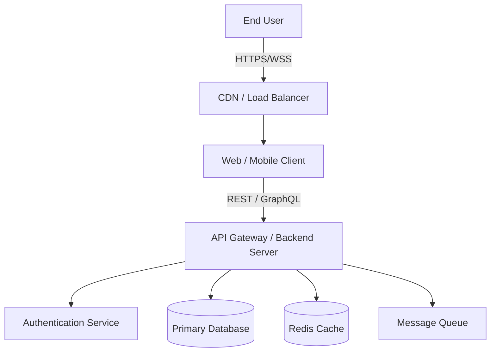
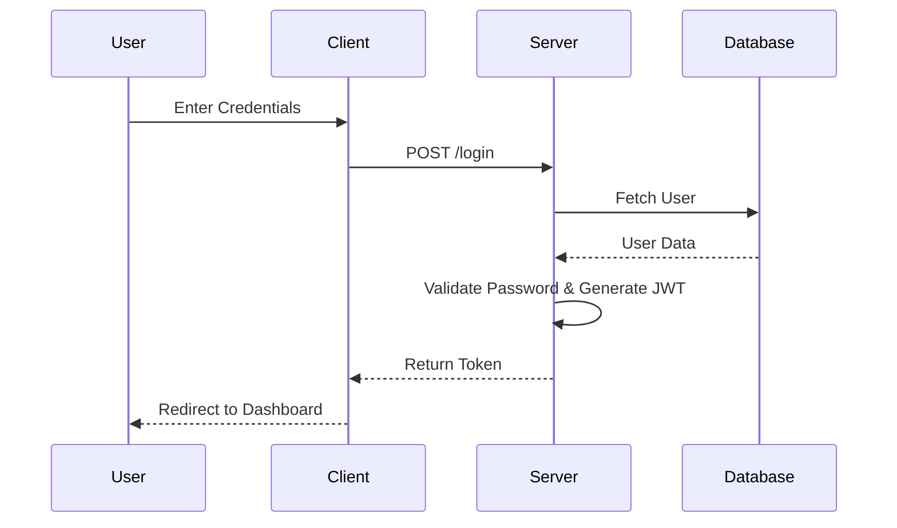

# Project Architecture

> **Document Status:** Draft  
> **Last Updated:** 2025-12-16

---

## 1. System Overview

**Prompt-Forge** is a modern software system designed to solve a clearly defined business or user problem for a specific target audience. The system emphasizes maintainability, scalability, and security.

### Key Goals

- **Scalability:** Support high concurrent usage and future growth
- **Reliability:** Ensure high availability and fault tolerance
- **Security:** Protect user data and system integrity

---

## 2. High-Level Architecture

The system follows a layered **Client–Server Architecture**, which can be adapted to Monolithic or Microservices patterns depending on deployment scale.

### Context Diagram (C4 Model – Level 1)



---

## 3. Component Design

### 3.1 Frontend

- **Framework:** React / Vue / Next.js
- **State Management:** Redux / Context API / Zustand
- **Styling:** Tailwind CSS / Styled Components
- **Build Tool:** Vite / Webpack

Responsibilities:

- UI rendering
- Client-side validation
- API communication

---

### 3.2 Backend

- **Runtime:** Node.js / Go / Python
- **Framework:** Express / NestJS / Django / Gin
- **API Paradigm:** REST / GraphQL / gRPC

Key Responsibilities:

- Authentication & Authorization
- Business logic execution
- Database interaction
- Event publishing

Example Services:

- **Auth Service:** Handles login, registration, and token generation
- **Core Service:** Handles domain-specific operations

---

### 3.3 Database & Storage

- **Primary Database:** PostgreSQL / MongoDB  
  Stores user data, transactions, and core entities.

- **Caching Layer:** Redis  
  Improves performance for frequent queries and sessions.

- **Object Storage:** AWS S3 / GCP Storage  
  Stores static files and user uploads.

---

## 4. Data Flow

### Example: User Login Flow

1. User submits credentials from Client.
2. Request hits Backend (`POST /login`).
3. Backend validates credentials.
4. JWT token generated.
5. Token returned to client via HttpOnly cookie.



---

## 5. Directory Structure

```bash
/root
├── client/              # Frontend Application
│   └── src/
│       ├── components/
│       └── hooks/
├── server/              # Backend Application
│   └── src/
│       ├── config/      # Environment & DB configs
│       ├── controllers/
│       ├── models/
│       └── routes/
├── infrastructure/      # Docker / Terraform / K8s
├── docs/                # Documentation
└── README.md
```

---

## 6. Infrastructure & Deployment

- **Hosting:** AWS / DigitalOcean / Vercel
- **Containerization:** Docker
- **Orchestration:** Kubernetes / Docker Swarm
- **CI/CD:** GitHub Actions / Jenkins

### Deployment Pipeline

1. Lint
2. Test
3. Build
4. Deploy to Staging
5. Deploy to Production

---

## 7. Security Measures

- **Authentication:** JWT / OAuth2
- **Authorization:** RBAC (Role-Based Access Control)

### Data Protection

- **At Rest:** AES-256 encryption
- **In Transit:** TLS 1.3
- **Input Validation:** Zod / Joi (prevents SQL Injection & XSS)

---

## 8. Future Improvements

- Add WebSocket support for real-time updates
- Introduce microservices for heavy workloads
- Improve observability with tracing and metrics

---

## Next Step

This document can be customized for:

- Node.js + Express
- NestJS
- Microservices Architecture
- Cloud-native deployment
