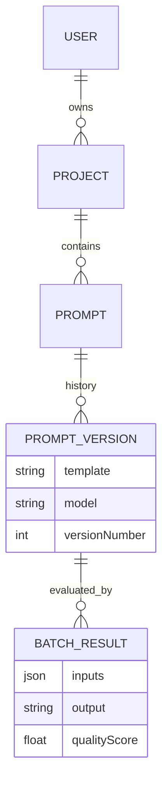

# PromptForge System Architecture

> **Version:** 1.0  
> **Status:** Final  
> **Last Updated:** December 2025

---

## 1. System Overview

**PromptForge** is a full-stack MLOps platform designed to streamline the prompt engineering lifecycle. It addresses the challenge of _prompt drift_ and model selection by providing a unified workspace to prototype, version, and evaluate prompts against multiple LLM providers (Groq/Llama and Google Gemini).

The system emphasizes:

- **Security:** Role-based access and secure credential management.
- **Scalability:** Modular backend architecture using NestJS.
- **Observability:** Persisted batch test results with automated quality metrics.

---

## 2. High-Level Architecture

The system follows a standard **Three-Tier Architecture**:

1. **Presentation Layer (Frontend):** A reactive Single Page Application (SPA).
2. **Application Layer (Backend):** A RESTful API server handling business logic and AI orchestration.
3. **Data Layer (Database):** A relational database for persistent storage.

### C4 Context Diagram

```mermaid
graph TD
    User[AI Engineer] -->|HTTPS| Client[Vue 3 Frontend]
    Client -->|REST API + JWT| Server[NestJS Backend]

    subgraph "Application Layer"
        Server -->|Auth & Users| AuthService
        Server -->|Prompt Logic| PromptService
        Server -->|Inference| AIService
    end

    subgraph "Data Layer"
        AuthService --> DB[(PostgreSQL)]
        PromptService --> DB
    end

    subgraph "External AI Providers"
        AIService -->|API Call| Groq[Groq API (Llama 3)]
        AIService -->|API Call| Gemini[Google Gemini API]
    end
```

---

## 3. Tech Stack & Design Decisions

### 3.1 Frontend (Client)

- **Framework:** Vue.js 3 (Composition API & `<script setup>`)
- **State Management:** Pinia (User session & JWT handling)
- **Routing:** Vue Router (Dashboard → Project → Prompt hierarchy)
- **Editor:** Monaco Editor (VS Code core) with Handlebars syntax highlighting
- **HTTP Client:** Axios with interceptors to auto-attach `Authorization: Bearer <token>`

---

### 3.2 Backend (Server)

- **Framework:** NestJS (Node.js), chosen for modularity and dependency injection
- **Authentication:** Passport-JWT with a global `AuthGuard`
- **Validation:** `class-validator` for strict DTO validation
- **AI Abstraction:** `AiService` implements an adapter pattern to support multiple providers without changing business logic

---

### 3.3 Database

- **Engine:** PostgreSQL
- **ORM:** Prisma (type-safe queries and schema management)
- **Migration Strategy:** `prisma db push` for rapid prototyping

---

## 4. Database Schema Design

The data model is hierarchical and relational:

- **User (1) ↔ (N) Project**
- **Project (1) ↔ (N) Prompt**
- **Prompt (1) ↔ (N) PromptVersion**
- **PromptVersion (1) ↔ (N) BatchResult**



---

## 5. Key Workflows

### 5.1 Side-by-Side Model Comparison

To enable fair model evaluation, requests are executed in parallel:

1. Frontend sends two async requests to `/ai/generate`
2. Backend routes:
   - Request A → Groq SDK
   - Request B → Google Gemini SDK
3. Responses are normalized with metadata (latency, cost)
4. Frontend renders results using `Promise.allSettled`

---

### 5.2 Automated Quality Metric (JSON Validation)

Batch testing pipeline:

1. User uploads CSV
2. Backend iterates through rows
3. AI generates output from template
4. System attempts `JSON.parse(output)`
   - **Pass (1.0):** Valid JSON
   - **Fail (0.0):** Invalid JSON
5. Result persisted in `BatchResult`
6. UI displays Green (valid) or Gray (invalid) badge

---

## 6. Security Implementation

- **Transport Security:** HTTPS assumed in production
- **Authentication:** Stateless JWT (HS256)
- **Password Security:** Argon2 / Bcrypt hashing
- **Secret Management:**
  - `GROQ_API_KEY`, `GEMINI_API_KEY`, `JWT_SECRET` stored in `.env`
  - Never exposed to client-side code

---

## 7. Future Scalability Improvements

- **Queueing:** Redis + BullMQ for large batch jobs (1000+ rows)
- **Caching:** Deduplicate identical prompt executions to reduce cost
- **RBAC:** Introduce Viewer vs Editor roles for team collaboration
